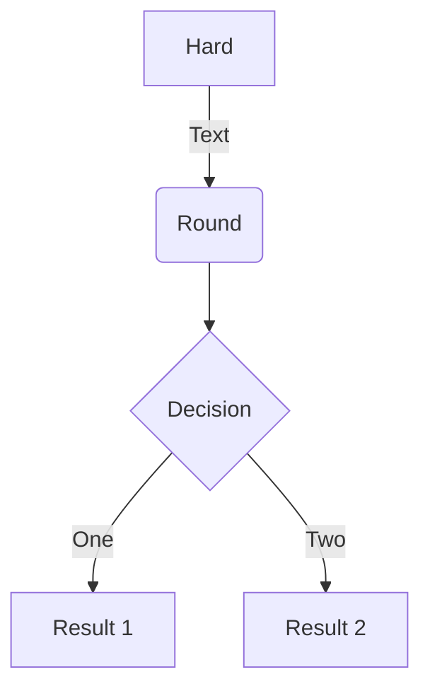
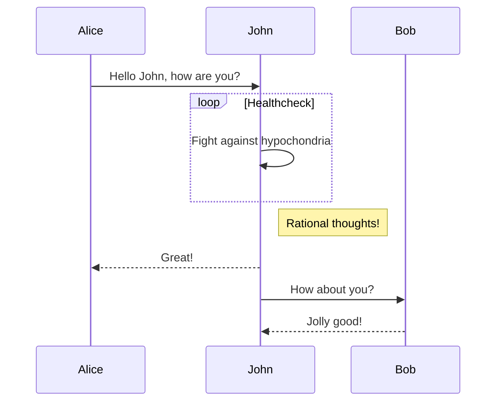
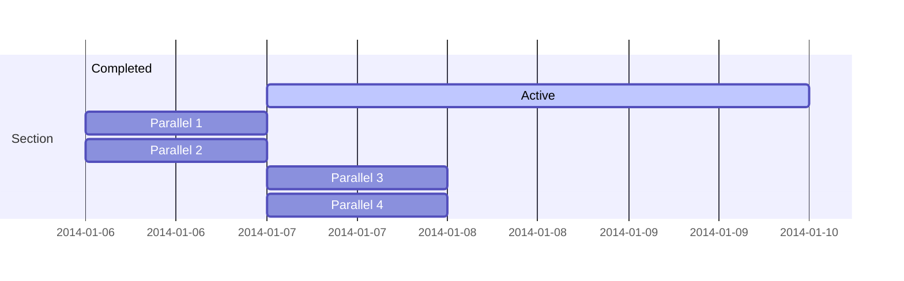
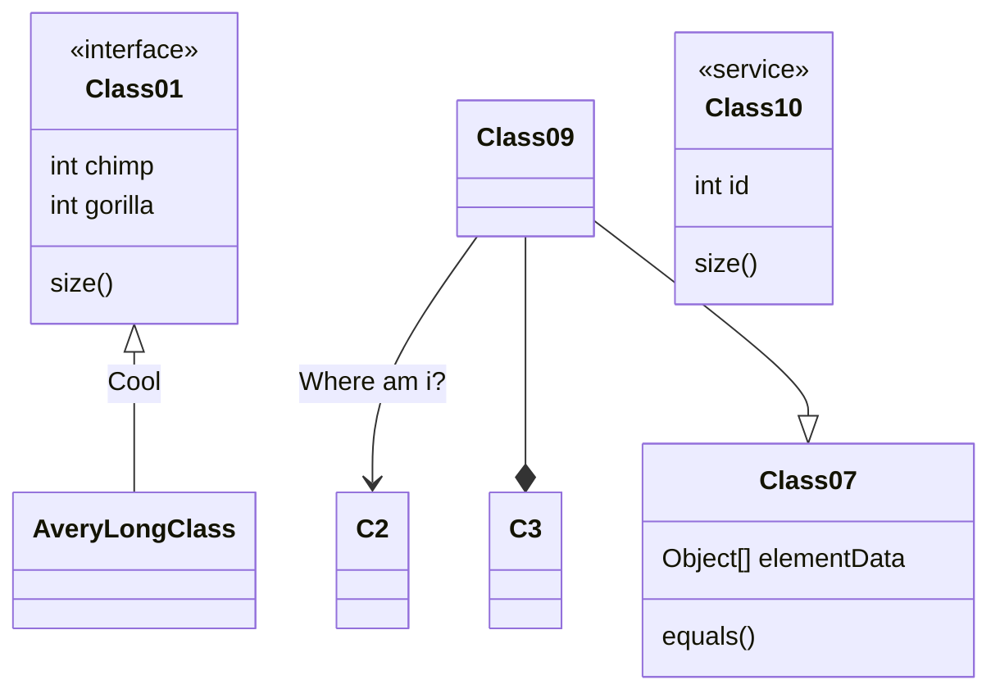
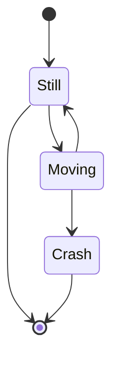

+++
title = "Org-mode basics"
author = ["mateus"]
date = 2020-12-03
tags = ["orgmode", "tutorials", "emacs"]
categories = ["Guides"]
draft = false
weight = 2001
summary = "Brief introduction to org-mode formatting"
math = true
diagram = true
[image]
placement = 3
caption = "Image credit: [**orgmode.org**](https://orgmode.org/)"
+++

<div class="ox-hugo-toc toc">
<div></div>

<div class="heading">Table of Contents</div>

- [Why org-mode?](#why-org-mode)
    - [A note on working with org-mode files](#a-note-on-working-with-org-mode-files)
    - [An alternative: RMarkdown](#an-alternative-rmarkdown)
- [Formatting](#formatting)
- [Headings and lists](#headings-and-lists)
- [Links and images](#links-and-images)
- [Symbols and equations](#symbols-and-equations)
- [Code and foldable blocks](#code-and-foldable-blocks)
- [Diagrams](#diagrams)
- [Todo lists](#todo-lists)
- [Tables](#tables)
- [Callouts](#callouts)
- [Spoilers](#spoilers)
- [Icons](#icons)

</div>
<!--endtoc-->

This is a brief introduction to formatting in [org-mode](https://orgmode.org/) made mostly to help my dear colleagues with writing content for the site


## Why org-mode? {#why-org-mode}

This website uses a single [org-mode](https://orgmode.org/) file to manage most of the content.
Org-mode is an example of a [markup language](https://en.wikipedia.org/wiki/Markup%5Flanguage), which means the text formating is described in the text itself.
This is in contrast to a "[what you see is what you get](https://en.wikipedia.org/wiki/WYSIWYG)" system where the formatting information is hidden from the user and stored in the file data somehow, as Microsoft Word does with it's proprietary file formats.

There are several advantages to using plain text.
Perhaps the most important of which is transportability and reproducibility.
You can't view or edit a .doc file without special software (which you often have to pay for), whereas plain text files can be viewed an edited on any computer, regardless of operating system, and with thousands of text editors to choose from.

The only real disadvantage to markup languages is that you have to learn their syntax.
This is only really an issue for some languages though, [html](https://en.wikipedia.org/wiki/HTML#:~:text=Hypertext%20Markup%20Language%20(HTML)%20is,scripting%20languages%20such%20as%20JavaScript.) (the language website are written in) is fairly complicated and fiddly, but languages like [markdown](https://en.wikipedia.org/wiki/Markdown#:~:text=Markdown%20is%20a%20lightweight%20markup,Markdown) and org-mode were made to be simple and easy to learn.
And this post is going to demonstrate the basics, so read on!

Plus, with a bit of magic from [pandoc](https://pandoc.org/) you can convert pretty much any markup language to any other markup language.
This lets us do things like export a markdown file to a really nice pdf, or html document!


### A note on working with org-mode files {#a-note-on-working-with-org-mode-files}

Org-mode is made to be used with the wonderful [Emacs](https://www.gnu.org/software/emacs/), which sells itself as an extensible text editor, but it's really just an elisp interpreter geared towards text editing.
Emacs makes working with org-mode files a joy, though it has a bit of a learning curve itself.
There are plenty of great [guides](https://www.gnu.org/software/emacs/tour/) and [videos](https://www.youtube.com/watch?v=49kBWM3RQQ8&list=PL9KxKa8NpFxIcNQa9js7dQQIHc81b0-Xg) for getting to grips with emacs, but you can of course use whatever plain text editor you like!


### An alternative: RMarkdown {#an-alternative-rmarkdown}

I'm using org-mode because I like emacs, but you can also use the wonderful [RMarkdown](https://rmarkdown.rstudio.com/) to create posts, and if you're a fan of [RStudio](https://www.rstudio.com/), there's a neat package called [blogdown](https://bookdown.org/yihui/blogdown/) to make adding content super easy.
I suspect some of you may prefer that, it is probably easier to get up an running with compared to emacs...


## Formatting {#formatting}

For example, if you would like **bold text**, you simply wrap the text with \* like so: `*bold*`
similarly, we can have:

<div class="table-caption">
  <span class="table-number">Table 1</span>:
  If you're wondering how I'm able to show the formatting without it rendering have a look at this .org file on the <a href="https://github.com/H-Mateus/spinal-studies-rjah-site/blob/master/content-org/all-posts.org">git repository</a>
</div>

| Rendered text                             | Raw text           |
|-------------------------------------------|--------------------|
| _italics_                                 | `/italics/`        |
| `monospace`                               | `=monospace=`      |
| `code`                                    | `~code~`           |
| ~~strike-through~~                        | `+strike-through+` |
| <span class="underline">underlined</span> | `_underlined_`     |

If you want a footnote&nbsp;[^fn:1] use `[fn:: footnote text goes here]`.
It even comes with a helpful return link!


## Headings and lists {#headings-and-lists}

For headings org-mode uses \*:

-   `* Level one header`
-   `** Level two header`
-   `*** Level three header`

and so on. Org-mode will automatically scale the text to the size of the level of the header.

For bullet point lists use `-` or `+` or numbers `1.`
The following:

-   using `-`

`- item 1` <br />
`- item 2`

-   using `+`

`+ item 1` <br />
`+ item 2`

-   using numbers

`1. numbered list 1` <br />
`2. numbered list 2`

Renders to:

1.  using `-`
    -   item 1
    -   item 2

2.  using `+`
    -   item 1
    -   item 2
3.  using numbers
    1.  numbered list 1
    2.  numbered list 2


## Links and images {#links-and-images}

To insert [links](https://en.wikipedia.org/wiki/Hyperlink) use square brackets like so: `[[link_address_goes_here][text_goes_here]]`
The link in the previous sentence looks like this:
`[[https://en.wikipedia.org/wiki/Hyperlink][links]]`

To insert images we do the same, but the link has to point to an image in the static/images directory of the site.
So `[[/images/red_panda.jpeg]]`
Results in the following image being embedded:



And if you're wondering about the captions, just add header on the line above whatever you want caption:

`#+CAPTION: caption text goes here` <br />
`thing you want a caption on goes here(normally an image or table)`


## Symbols and equations {#symbols-and-equations}

For things like Greek letters just type the letter after a `\` like so:

| &alpha;  | `\alpha` |
|----------|----------|
| &beta;   | `\beta`  |
| &gamma;  | `\gamma` |
| &plusmn; | `\pm`    |
| &ge;     | `\ge`    |
| &ne;     | `\neq`   |

For more complex equations we can use [latex math](https://en.wikibooks.org/wiki/LaTeX/Mathematics) syntax and wrap in single `$` for inline equations, and double `$$` for equation blocks.
So `$a=+\sqrt{2}$` renders to \\(a=+\sqrt{2}\\).

And `$$P\left(A=2\middle|\frac{A^2}{B}>4\right)$$` renders to

\\[P\left(A=2\middle|\frac{A^2}{B}>4\right)\\]

We can also wrap in `\(` and close with `\)` for inline and `\[` `\]` for blocks to produce the same effect


## Code and foldable blocks {#code-and-foldable-blocks}

So there's this awesome package called [org-babel](https://orgmode.org/worg/org-contrib/babel/) that let you include code from pretty much any widely used language in org-mode files.
I won't go into depth on org-babel here as there's a lot to it, but I'll use it to demonstrate folding blocks (click on the line bellow with the triangle to expand or collapse the block)

<details>
<summary>
A little R code
</summary>
<p class="details">

```R
## notice we get nice code highlighting to boot
head(mtcars)

for(i in 1:3){
print("code")}
```

```text
                   mpg cyl disp  hp drat    wt  qsec vs am gear carb
Mazda RX4         21.0   6  160 110 3.90 2.620 16.46  0  1    4    4
Mazda RX4 Wag     21.0   6  160 110 3.90 2.875 17.02  0  1    4    4
Datsun 710        22.8   4  108  93 3.85 2.320 18.61  1  1    4    1
Hornet 4 Drive    21.4   6  258 110 3.08 3.215 19.44  1  0    3    1
Hornet Sportabout 18.7   8  360 175 3.15 3.440 17.02  0  0    3    2
Valiant           18.1   6  225 105 2.76 3.460 20.22  1  0    3    1
[1] "code"
[1] "code"
[1] "code"
```
</p>
</details>

So there are three parts here:

`#+begin_details` <br />
`#+begin_summary` <br />
`A little R code` <br />
`#+end_summary` <br />
`#+begin_src` <br />
`## notice we get nice code highlighting to boot` <br />
`head(mtcars)` <br />
`for(i in 1:3){` <br />
`print("code")}` <br />
`#+end_src` <br />
`#+end_details` <br />

The whole thing is wrapped in the `begin_details` block, the text next the triangle is defined in the `begin_summary`, and the code is in the `begin_src` block.
Note that each block must be closed, and that code doesn't have to be run, the output with be produced during export


## Diagrams {#diagrams}

We can use the [mermaid](https://mermaid-js.github.io/mermaid/#/) markup syntax to add nice diagrams too.

An example **flowchart**:

```text
#+begin_src mermaid
graph TD
A[Hard] -->|Text| B(Round)
B --> C{Decision}
C -->|One| D[Result 1]
C -->|Two| E[Result 2]
#+end_src
```

renders as



An example **sequence diagram**:

```text
#+begin_src mermaid
sequenceDiagram
Alice->>John: Hello John, how are you?
loop Healthcheck
    John->>John: Fight against hypochondria
end
Note right of John: Rational thoughts!
John-->>Alice: Great!
John->>Bob: How about you?
Bob-->>John: Jolly good!
#+end_src
```

renders as



An example **Gnatt diagram**

```text
#+begin_src mermaid
gantt
section Section
Completed :done,    des1, 2014-01-06,2014-01-08
Active        :active,  des2, 2014-01-07, 3d
Parallel 1   :         des3, after des1, 1d
Parallel 2   :         des4, after des1, 1d
Parallel 3   :         des5, after des3, 1d
Parallel 4   :         des6, after des4, 1d
#+end_src
```

renders as



An example **class diagram**:

```text
#+begin_src mermaid
    classDiagram
    Class01 <|-- AveryLongClass : Cool
    <<interface>> Class01
    Class09 --> C2 : Where am i?
    Class09 --* C3
    Class09 --|> Class07
    Class07 : equals()
    Class07 : Object[] elementData
    Class01 : size()
    Class01 : int chimp
    Class01 : int gorilla
    class Class10 {
      <<service>>
      int id
      size()
    }
#+end_src
```

renders as



An example **state diagram**:

```text
#+begin_src mermaid
    stateDiagram
    [*] --> Still
    Still --> [*]
    Still --> Moving
    Moving --> Still
    Moving --> Crash
    Crash --> [*]
#+end_src
```

renders as




## Todo lists {#todo-lists}

You can even write your todo lists in Academic too:

`- [X] Write math example` <br />
`- [X] Write diagram example` <br />
`- [ ] Do something else`

renders as

-   [X] Write math example
-   [X] Write diagram example
-   [ ] Do something else


## Tables {#tables}

Represent your data in tables:

`| First Header | Second Header |` <br />
`|--------------+---------------|` <br />
`| Content Cell | Content Cell  |` <br />
`| Content Cell | Content Cell  |` <br />

renders as

| First Header | Second Header |
|--------------|---------------|
| Content Cell | Content Cell  |
| Content Cell | Content Cell  |


## Callouts {#callouts}

Academic supports a [shortcode for callouts](https://sourcethemes.com/academic/docs/writing-markdown-latex/#alerts), also referred to as **asides**, **hints**, or **alerts**. By wrapping a paragraph in `{} ... {}`, it will render as an aside.

```markdown
{}
A Markdown aside is useful for displaying notices, hints, or definitions to your readers.
{}
```

renders as

{}
A Markdown aside is useful for displaying notices, hints, or definitions to your readers.
{}


## Spoilers {#spoilers}

Add a spoiler to a page to reveal text, such as an answer to a question, after a button is clicked.

```markdown

You found me!

```

renders as

 You found me! 


## Icons {#icons}

Academic enables you to use a wide range of [icons from <span class="underline">Font Awesome</span> and \_Academicons\_](<https://sourcethemes.com/academic/docs/page-builder/#icons>) in addition to [emojis](<https://sourcethemes.com/academic/docs/writing-markdown-latex/#emojis>).

Here are some examples using the \`icon\` shortcode to render icons:

```markdown
 Terminal
 Python
 R
```

renders as

 Terminal
 Python
 R

[^fn:1]: org-mode sure is neat!
