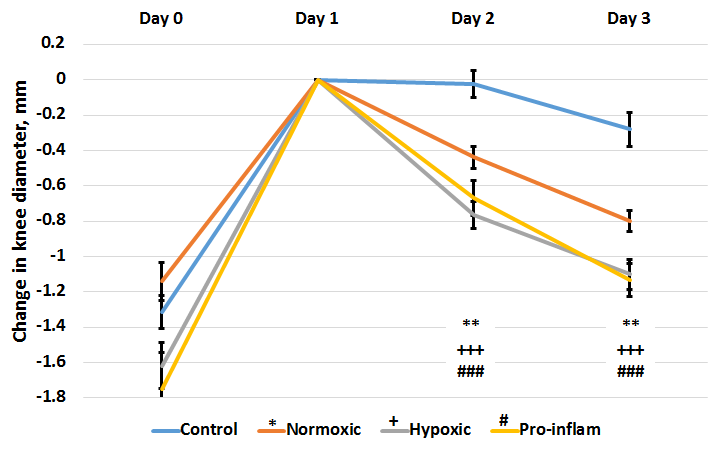
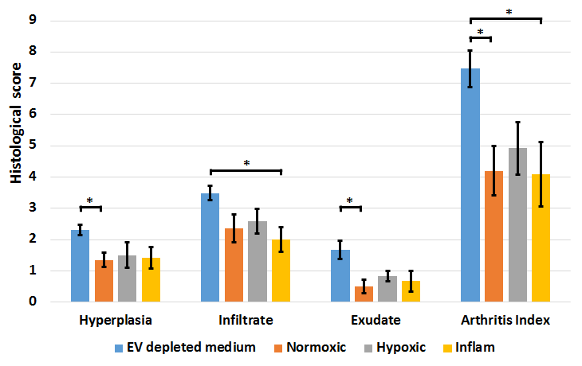

```{r, label='setup-options', include=FALSE}
knitr::opts_chunk$set(
  eval = TRUE, # eval code chunks
  echo = FALSE, # include source code
  #fig.width = 6, # set figure dims
  #fig.height = 6
  fig.align = 'center',
  warning = FALSE, # exclude warnings
  message = FALSE, # exclude messages
  error = FALSE # exclude errors
)
```

Rheumatoid arthritis is a painful autoimmune disorder characterised by synovial inflammation that leads to progressive destruction of articular cartilage.
There is no cure for RA and life expectancy of sufferers may be reduced by up to 18 years. For that reason, it is vital to develop a new and more effective therapy for RA.
Mesenchymal stem cells (MSCs) possess anti-inflammatory and immunosuppressive properties and function predominantly through paracrine mechanisms, via growth factors, cytokines, chemokines and bioactive, membrane-bound extracellular vesicles (EVs) found in mesenchymal stem cell conditioned medium (CM-MSC).
Our previous project demonstrated that CM-MSC reduces swelling and cartilage destruction through modulation of the immune response in a murine model of inflammatory arthritis.
This current study is assessing the contribution of extracellular vesicles to this therapeutic outcome, and examining how the culture microenvironment of MSCs can be manipulated to enhance their therapeutic effectiveness.
Extracellular vesicles are applied as a treatment in our pre-clinical model of experimental arthritis, looking at their effects on inflammation, histological outcomes of disease progression and T cell polarisation towards either pro- or anti-inflammatory cell types.

Stem cells isolated from human bone marrow aspirate were used to derive extracellular vesicles. Following the application of vesicles, knee joint swelling significantly reduced at both 24 and 48 hours after treatment in our pre-clinical model (Figure 1). Reductions were highly significant in comparison to control animals where knee joints continued to swell in the absence of extracellular vesicles.
Histological analysis reviled improved scores for cartilage and arthritis index (Figure 2).

The significant reduction in joint swelling following EVs treatment demonstrates their effectiveness as a new therapeutic intervention.
Further investigation will identify the mechanisms involved.

```{r 'figures', fig.cap='Therapeutic outcomes in an inflammatory arthritis model (AIA). Alleviation of joint swelling as a measure of therapeutic efficacy following EV treatments show significant influence of EVs compared to controls at day 2 and day 3 after arthritis induction, normalised to peak swelling.'}

```

```{r 'fig2', fig.cap='Examination of histological signs of arthritis pathogenesis following EV treatment shows significant therapeutic effects of EVs sourced from normoxic and pro-inflammatory pre-conditioned MSC cultures.'}

```

