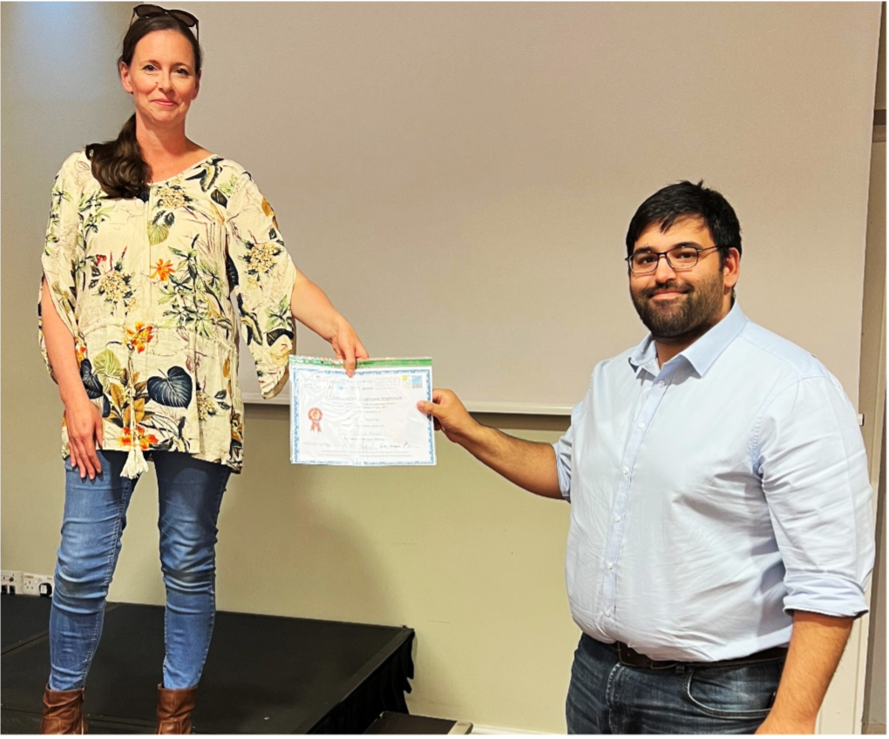

Blablabla Keele hold courses and conferences enhancing visibility and collaboration...
<br><br>
## Keele courses and conferences  

- [PGR Symposium 2022](#pgr-symposium-2022), [2023](#pgr-symposium-2023), [2024](#pgr-symposium-2024)   

- [Cartilage Symposium 2022](#cartilage-symposium-2022)

- [Tissue Microenvironment and Disease Workshop 2023 20-21-Apr-2023](#tissue-microenvironment-2023)

- [Bioreactor Course, Keele University 21-Mar-2023 - 24 -Mar-2023](#bioreactor-course-2023)  

<br><br>

<h2 id="pgr-symposium-2024">PGR Symposium 2024</h2>

Dr Jade Perry gave a career talk
Final years PhD students Anaïs Makos and Tian Lan gave excellent 15 minute talk and highlight findings of thesis.
Poster: Henry Barrett, Hollie Wilkinson, Abi Jones, Tom Link, Yumna Ladha.
3-minute thesis: Larissa Rix

<br><br>

<h2 id="pgr-symposium-2023">PGR Symposium 2023</h2>
...

<br><br>

<h2 id="tissue-microenvironment-2023">Tissue Microenvironment and Disease Workshop 2023 20-21-Apr-2023</h2>

Several members of the group attened a fantastic 2-day workshop at Keele Hall, with some excellent speakers on topics including: Imaging the diseased microenvironment; Data based approaches to microenvironmental analysis; Biological methods in the tumour microenvironment.  Our team did brilliantly with Dr Helen McCarthy and Ms Hollie Wilkinson winning poster and oral prizes! 

<br><br>

<h2 id="bioreactor-course-2023">Bioreactor Course, Keele University 21-Mar-2023 - 24-Mar-2023</h2>

Drs Charlotte Hulme and Karina Wright organised the 2023 Bioreactors and Growth Environments Workshop. The workshop welcomed over 70 delegates, from the UK, Europe and further afield. Speakers included experts from academia and industry, providing an overview of the basic principles of bioreactor design through to their clinical applications. We had some excellent student engagement in the 'Design a Bioreactor Challenge', with the winning group working together to develop a novel bioreactor for assessing tissue engineered tendons. 

<br><br>

<h2 id="cartilage-symposium-2022">Cartilage Symposium 2022</h2>

```{r echo=FALSE, out.width="100%"}
knitr::include_graphics("group1.jpg")
```

On the 7th and 8th of June 2022 the 12th Oswestry/Keele Cartilage Symposium was held at Keele Hall, organised by Dr Helen McCarthy, Dr Karina Wright, Prof Martyn Snow, Prof Sally Roberts, and Mr Paul Jermin.

The international symposium gathered surgeons and scientists from the UK, Ireland, Germany, Switzerland, and USA to talk about the latest research and clinical updates in terms of treatments, biomarkers next generation biological repair and rehabilitation.

During these two days, speakers focus on “Influencing factors in cartilage repair outcomes”, “Current trends in cartilage repair”, “Next generation biological repair”, “Pain in Osteoarthritis”, and “Biomarkers for monitoring knee diseases and treatments”

```{r echo=FALSE, out.width="100%"}
knitr::include_graphics("session1.png")
```

Abstracts:

Dr Jan Herman Kuiper – ACTIVE, a multicentre RCT of ACI versus other surgical interventions for cartilage defects: five-year results”  

Mr Paul Jermin – Autologous blood products with or without platelets  

Dr Karina Wright – Proteomic characterization of response to ACI  

Dr Bernhard Tins – Imaging as a biomarker  

An early career session was also organised to allow PhD student and post-docs to introduce their projects to experts in the field.

```{r echo=FALSE, out.width="100%"}
knitr::include_graphics("session2.png")
```

Abstracts:

Rebecca Davies – Umbilical cord mesenchymal stromal cell derived extracellular vesicles match, and perhaps surpass, their parental cell’s ability to treat inflammatory arthritis  

Tian Lan – Characterisation of mesenchymal stromal cells isolated from autologous bone marrow aspirate concentrates used clinically in the treatment of cartilage defects in the ankle  

Anaïs Makos – Predicting patients’ response to TNF inhibitors using potential blood biomarkers in Psoriatic Arthritis  


Congratulations to Dr Mahid Ahmed (Newcastle) who won the early career presentation award with “A bioprinted high-throughput human 3D osteochondral model for osteoarthritis research”

```{r echo=FALSE, out.width="50%"}

```

Thank you to all the presenters for being with us and for sharing their hard work to the assembly and thank you to the organisers who did an amazing job hosting the event and providing an opportunity for us to discuss our data with international experts from around the world.

```{r echo=FALSE, out.width="80%"}
knitr::include_graphics("sponsor.png")
```

<br><br>

<h2 id="pgr-symposium-2022">PGR Symposium 2022</h2>

On the 29th of April was held the Faculty of Medicine and Health Sciences 2022 PGR Symposium at Keele University. PhD students from faculty of Medicine and Health Sciences gathered to share their project in the form of 3 minutes presentation (3-minute thesis), 10 minutes presentation and poster presentation.

Three PhD students from our department participated to this symposium: 

  - Rebecca Davis: “The therapeutic effect of umbilical cord mesenchymal stromal cell extracellular vesicles in inflammatory arthritis”
  
  - Anaïs makos: “Immune cell profile in patient with Psoriatic Arthritis”
  
  - Tian Lan: “Characterisation of mesenchymal stromal cells isolated from autologous bone marrow aspirate concentrates used clinically in the treatment of cartilage defects in the ankle”

The oral presentation runner up prize went to Rebecca Davis for her presentation of extracellular vesicles (EV) “The therapeutic effect of umbilical cord mesenchymal stromal cell extracellular vesicles in inflammatory arthritis”.

```{r echo=FALSE, out.width="100%"}
knitr::include_graphics("prize.png")
```

