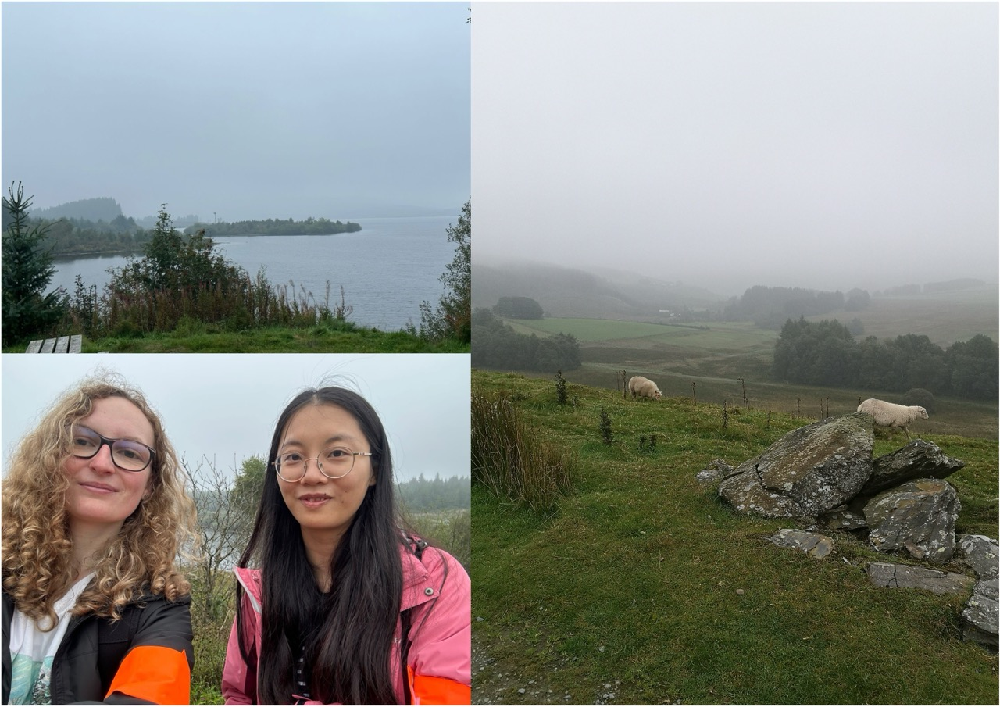
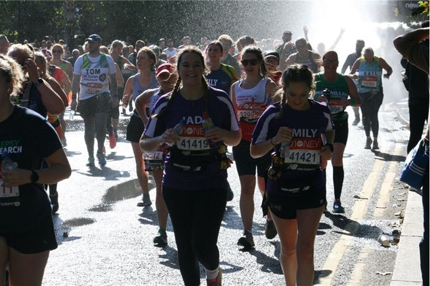

- [Sponsored walk - 2023](#walk-2023)  
- [Snowpaedic challende - 2022](#snowpaedic-2022)  
- [London Marathon - 2021](#marathon-2021). 

<h2 id="walk-2023">**Sponsord walk at the Llyn Brenig Lake**</h2>

```{r echo=FALSE, out.width="100%"}

```

On the 16th of September 2023, researchers and students of the OSKOR groups participated in a walk around the beautiful Llyn Brenig Lake, and raised money to improve research in Duchenne Muscular Dystrophy.
Duchenne Muscular Dystrophy (DMD) is a genetic disorder marked by the gradual weakening and degeneration of muscles. It ranks among the most prevalent and severe types of muscular dystrophy. This rare disease is typically diagnosed in early childhood and results in a shortened lifespan.

<br><br>

<h2 id="snowpaedic-2022">**Snowpaedic challenge**</h2>

```{r echo=FALSE, out.width="100%"}
knitr::include_graphics("pictures.png")
```

On Saturday the 10th of September 2022, our research team participated to the annual Snowpaedic challenge, a sponsored walk organized by the Orthopaedic Institute Charity to support research and education at the RJAH Orthopaedic Hospital.

This year, the Orthopaedic Institute Charity raised fund to support a research study into the Charcot-Marie-Tooth(CMT) disease, a hereditary motor and sensitive neuropathy of the Peripheral Nervous System (PNS). The disease is characterized by progressive loss of muscle tissue and touch sensation across diverse parts of the body.

The Orthopaedic Institute Charity has supported research and educational project at the RJAH Hospital for over 50 years to benefit patients with musculo-skeletal conditions such as arthritis, rheumatism and spinal cord injuries. It also support joint replacement and cell therapy for repair and healing.

<br><br>

<h2 id="marathon-2021">**London Marathon to support the RJAH Orthopaedic Charity**</h2>

```{r echo=FALSE, out.width="100%"}

```

Our reserachers based at the RJAH Orthopaedic hopital took part in the Virgin London Marathon on the 3rd of October 2021. Dr Jade Perry and Ms Emily Storey managed to raise over £2,500 for the RJAH Orthopaedic hosptial charitable fund.
Running this marathon was a huge challenge, and donations will be used for the benefit of the patients and staff at the hospital.
