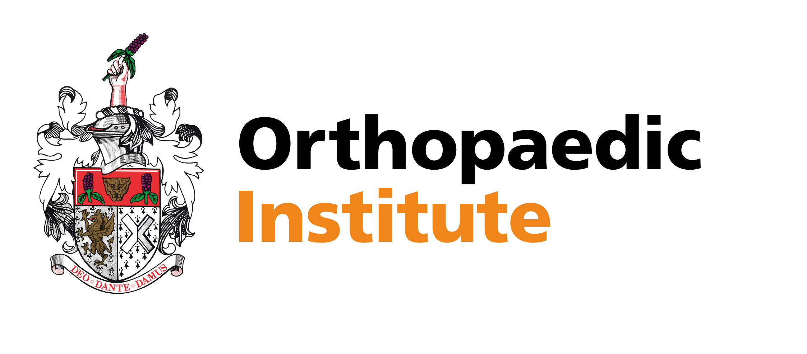
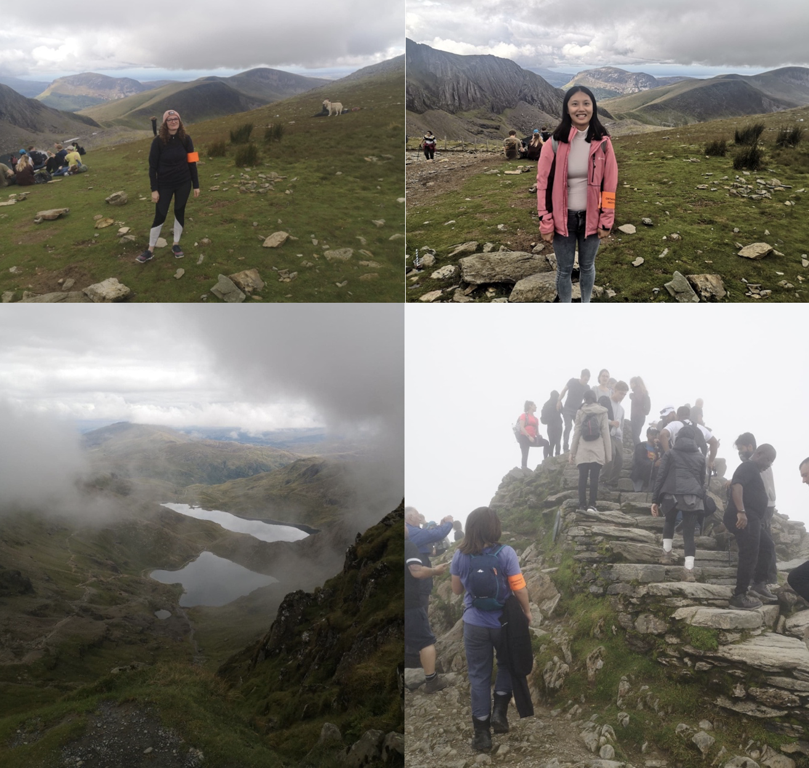

On Saturday the 10th of September 2022, our research team participated to the annual Snowpaedic challenge, a sponsored walk organized by the Orthopaedic Institute Charity to support research and education at the RJAH Orthopaedic Hospital.

This year, the Orthopaedic Institute Charity raised fund to support a research study into the Charcot-Marie-Tooth(CMT) disease, a hereditary motor and sensitive neuropathy of the Peripheral Nervous System (PNS). The disease is characterized by progressive loss of muscle tissue and touch sensation across diverse parts of the body.

The Orthopaedic Institute Charity has supported research and educational project at the RJAH Hospital for over 50 years to benefit patients with musculo-skeletal conditions such as arthritis, rheumatism, spinal cord injuries, joint replacement and cell therapy for repair and healing.

```{r echo=FALSE, out.width="30%"}

```

Pictures:

```{r echo=FALSE, out.width="100%"}

```
