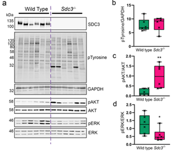

```{r, label='setup-options', include=FALSE}
knitr::opts_chunk$set(
  eval = TRUE, # eval code chunks
  echo = FALSE, # include source code
  #fig.width = 6, # set figure dims
  #fig.height = 6
  fig.align = 'center',
  warning = FALSE, # exclude warnings
  message = FALSE, # exclude messages
  error = FALSE # exclude errors
)
```

Inflammation is a central feature of rheumatoid arthritis that affects around 1% of the population and can result in disability and morbidity.
The immunomodulatory effects of bone marrow derived mesenchymal stem cells (MSCs) has been widely studied and the recent observations that syndecan-3 (SDC3) is selectively pro-inflammatory in the joint led us to hypothesise that SDC3 might play an important role in MSC biology.
MSCs isolated from bone marrow of wild type and  Sdc3-/- mice were used to assess immunophenotype, differentiation, adhesion and migration properties and cell signalling pathways.
While both cell types show similar differentiation potential and  forward scatter values, the cell complexity in wild type MSCs was significantly higher than in Sdc3-/- cells and was accompanied by lower spread surface area.
Moreover, Sdc3-/- MSCs adhered more rapidly to collagen type I and showed a dramatic increase in AKT phosphorylation, accompanied by a decrease in ERK1/2 phosphorylation compared with control cells.
In a mouse model of antigen-induced inflammatory arthritis, intraarticular injection of Sdc3-/- MSCs yielded enhanced recovery compared to injection of wild type MSCs.
In conclusion, our data suggest that syndecan-3 regulates MSC adhesion and efficacy in inflammatory arthritis, likely via induction of the AKT pathway (Figure 1).

```{r 'figure1', fig.cap='Loss of SCD3 in MSCs causes increased ATK phosphorylation and a reduction in ERK phosphorylation.  (A) representative images of blots used for quantification. SDC3 knockout was confirmed for Sdc3-/- MSCs in each sample (B) Total phosphorylated tyrosine normalised to GAPDH. (C) Phosphorylated AKTSer473 was normalised to total AKT. (D) Phosphorylated ERKThr202/Tyr204 was normalised to total ERK. Quantification was performed using ImageJ.'}

```

